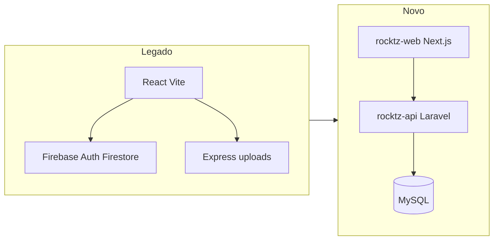
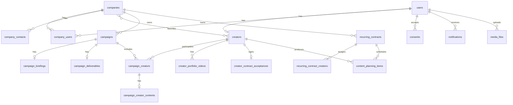
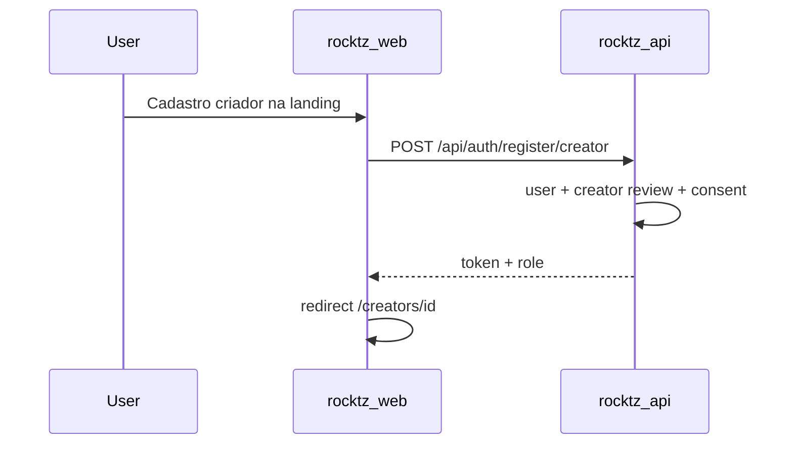

# Refatoração Rocketz Creators — Fase 1 (docs, landing e auth)

Documentar o legado, scaffoldar Laravel (Sanctum + MySQL com o schema completo) e Next.js, e entregar na primeira fase a landing, cadastro/login e redirecionamento por papel — sem Firebase.

## O que o legado é hoje

O app em [`legado/Rocketz-Creator-main`](../legado/Rocketz-Creator-main) é um **SPA React 19 + Vite + Tailwind v4** com **Firebase Auth/Firestore** e um **Express só para upload/transcode**. Não existe API de negócio: CRUD, papéis e regras vivem no cliente. As regras do Firestore são permissivas (leitura pública na maior parte; escrita se autenticado).

Três papéis:

- **admin** — e-mails hardcoded + `creators.role = admin`
- **company** — via `companyUsers`
- **creator** — documento em `creators/{uid}`, status inicial `review`

Fluxos centrais a preservar depois (não nesta fase): campanhas + candidaturas, entregas (script/vídeo), contratos recorrentes + planning, notificações, termo de adesão, LGPD, mídia.

Manter [`legado/`](../legado/) como referência somente leitura. Não apagar.



## Estrutura do monorepo

```
rocketz-creators/
  legado/                 # referência, não evolui
  rocktz-api/             # Laravel (API)
  rocktz-web/             # Next.js (App Router)
  rocktz-docs/            # Markdown da refatoração
```

Remover os placeholders [`rocktz-api/api.txt`](../rocktz-api/api.txt), [`rocktz-docs/docs.txt`](docs.txt) e [`rocktz-web/web.tx`](../rocktz-web/web.tx) ao scaffoldar.

**Defaults desta fase:** Laravel estável mais recente + Sanctum, **MySQL 8** (`utf8mb4`), Next.js App Router, Tailwind v4, CORS entre `localhost:3000` (web) e `localhost:8000` (API). Auth por **Bearer token** (Sanctum personal access tokens), adequado a origens separadas.

O schema MySQL cobre **todo o domínio** na fase 1 (migrations + seeders de teste). Os endpoints e telas além de auth/landing ficam para depois, mas o banco já nasce completo para desenvolver e testar em cima.

---

## 1. Documentação em `rocktz-docs`

Markdown versionado, escrito **antes e junto** do código. Sem gerador de site nesta fase.

- [`README.md`](README.md) — índice
- [`01-visao-geral.md`](01-visao-geral.md) — produto, papéis, o que sai (Firebase, `manualPassword`, dual `campaignCreators`)
- [`02-auditoria-legado.md`](02-auditoria-legado.md) — rotas, coleções, páginas, dívidas
- [`03-modelo-de-dominio.md`](03-modelo-de-dominio.md) — entidades e enums completos
- [`04-auth-e-rbac.md`](04-auth-e-rbac.md) — papéis, signup, redirects, Sanctum
- [`05-banco-de-dados.md`](05-banco-de-dados.md) — schema MySQL, migrations, seeders, contas de teste
- [`06-api.md`](06-api.md) — contratos HTTP da fase 1 + esboço dos recursos futuros
- [`07-frontend.md`](07-frontend.md) — rotas Next.js, tokens visuais, shells
- [`08-setup.md`](08-setup.md) — MySQL, `migrate:fresh --seed`, como rodar API + web
- [`decisoes.md`](decisoes.md) — ADR curto (Next.js, Sanctum token, MySQL 8, schema completo no dia 1, sem Firebase)

Marca a portar (de [`legado/.../src/index.css`](../legado/Rocketz-Creator-main/src/index.css)): Inter, `#6366F1`, sidebar `#111827`, landing `#FDFDFE`, login `#0F172A`, wordmark rocket**z**.

---

## 2. API Laravel (`rocktz-api`) — MySQL completo + auth na API

Scaffold Laravel, `.env` com `DB_CONNECTION=mysql`, CORS, Sanctum, middleware de papel.

**Banco:** MySQL 8, charset `utf8mb4` / collation `utf8mb4_unicode_ci`. Enums de domínio como `VARCHAR` + PHP Enum (não ENUM nativo do MySQL), para evoluir status sem `ALTER`. FKs com `onDelete` explícito. JSON só onde o legado já era objeto livre (sociais, métricas, pricing, attachments).

Nesta fase criamos **todas as migrations e seeders do domínio**. Endpoints além de auth continuam para depois; o banco e os dados de teste já existem.

### 2.1 Migrations (schema completo)

Auth / pessoas:

- `users` — `name`, `email` unique, `password` nullable (Google), `role` (`admin|creator|company`), `google_id` nullable unique, `email_verified_at`
- `creators` — 1:1 `user_id`; perfil completo do legado (`full_name`, `artistic_name`, `photo_url`, `document`, `cpf`, `whatsapp`, `city`, `state`, `birth_date`, `pix_key`, `bank_details` text, `socials` JSON, `metrics` JSON, `categories` JSON, `pricing` JSON, flags de permuta/tráfico/exclusividade, `bio`, `work_affinities` JSON, `internal_notes`, `status` `active|review|paused|rejected`). Sem `manual_password`.
- `creator_portfolio_videos` — `creator_id`, `title`, `url`, `description`, `uploaded_at`
- `creator_contract_acceptances` — termo eletrônico (term_id, version, document, accepted_at, ip/user_agent, declarations JSON, `status` `valid|revoked`)
- `companies` — CNPJ, segmento, responsável, contatos-raiz, cidade, observações, `logo_url`, `status` `active|pending|rejected`
- `company_contacts` — N:1 company
- `company_users` — portal (`user_id`, `company_id`, `status`)
- `company_favorite_creators` — pivot company/creator
- `consents` — LGPD (`user_id`, `type`, `accepted_at`, `ip`, `user_agent`)

Campanhas:

- `campaigns` — `company_id`, datas, orçamentos, `status` (`briefing|selection|approval|production|published|finished`), flags `is_secret`, `is_direct_contract`, `is_barter`, `approval_flow`
- `campaign_briefings` — 1:1 campaign (produto, mensagem, must/donts, CTA, hashtags, link, cupom, `attachments` JSON)
- `campaign_deliverables` — 1:1 (quantidades por formato, `deadline_days`, guidelines)
- `campaign_creators` — **uma** tabela de participação (substitui dual Firestore): application/delivery/payment, estágios script/vídeo, assinatura, notes
- `campaign_creator_contents` — script, URLs, story_prints JSON, metrics JSON

Recorrência:

- `recurring_contracts` — `company_id`, título, datas, `status` `active|paused|finished`, `monthly_fee`
- `recurring_contract_creators` — criadores do retainer + caches/fees + `monthly_deliverables` JSON
- `content_planning_items` — pauta mensal (`month` YYYY-MM, `content_type`, briefing, estágios, URLs, status)

Transversal:

- `notifications` — `type`, `target_role`, FKs opcionais (user/creator/campaign/contract), `read`, `link`
- `media_files` — `filename`, `disk`, `path`, `mime_type`, `size`, `uploaded_by`, morph opcional (`mediable_type/id`)
- Sanctum `personal_access_tokens` + `password_reset_tokens`

Índices: e-mail, `role`, statuses, `campaign_id`+`creator_id` unique em `campaign_creators`, `recurring_contract_id`+`month` em planning.



### 2.2 Factories + seeders de teste

Factories para todas as entidades acima (Faker pt_BR: CPF/CNPJ, WhatsApp, cidades).

`DatabaseSeeder` chama seeders dedicados. Senha padrão de teste: `password` (documentada). Cenário mínimo para clicar no front e nas fases seguintes:

- `AdminSeeder` — 1 admin (`admin@rocketz.test`)
- `CreatorSeeder` — criadores `review`, `active`, `paused`, `rejected`; um com contrato aceito e portfólio
- `CompanySeeder` — empresas `pending` e `active`; contatos; `company_users`; favoritos
- `CampaignSeeder` — campanhas em vários status; briefing + deliverables; candidaturas pending/approved/rejected; entregas em script/vídeo; uma paga e assinada
- `RecurringSeeder` — 1 contrato ativo + criadores + pautas (`planned` até `published`)
- `NotificationSeeder` — inbox admin e criador
- `ConsentSeeder` — LGPD nos users de teste
- `MediaSeeder` — registros de mídia apontando para disk `local` (sem binários grandes)

Comando: `php artisan migrate:fresh --seed`. Documentar contas em [`05-banco-de-dados.md`](05-banco-de-dados.md) e [`08-setup.md`](08-setup.md).

**Não portar:** `manualPassword`; whitelist de e-mail no código; dual `campaignCreators`. Reset de senha padrão do Laravel.

### Endpoints fase 1 (API; o resto do schema já existe)

- `POST /api/auth/register/creator` — cria user+creator (`status=review`), grava consentimento, devolve token + user
- `POST /api/auth/register/company` — cria user+company+company_user (`status=pending`)
- `POST /api/auth/login` — e-mail/senha
- `POST /api/auth/logout`
- `GET /api/auth/me`
- `POST /api/auth/forgot-password` / `POST /api/auth/reset-password`
- `GET /api/auth/google/redirect` + `GET /api/auth/google/callback` (Socialite) — callback redireciona para o Next.js com token (query ou hash); se o Google user for novo, o front completa o tipo (criador vs empresa) num passo extra
- `GET /api/health`

Policies: `me` sempre; admin seed só no seeder. Criador recém-cadastrado entra no portal mesmo em `review` (como o legado). Empresa `pending` também entra no portal da empresa (aprovação admin é fase posterior).

---

## 3. Front Next.js (`rocktz-web`) — landing + auth

App Router, TypeScript, Tailwind v4 com os tokens do legado, `lucide-react` + `motion` na landing.

Camada HTTP: `lib/api.ts` (fetch + `Authorization: Bearer`), token em cookie httpOnly via Route Handler **ou** `localStorage` na fase 1 (documentar a escolha; preferência: cookie httpOnly no Next para o token Laravel).

Rotas públicas:

- `/` e `/join` — portar seções e modais de [`LandingPage.tsx`](../legado/Rocketz-Creator-main/src/pages/LandingPage.tsx) (hero, benefícios, como funciona, CTAs empresa/criador, footer). Cadastro chama a API, não Firestore.
- `/login` — portar [`Login.tsx`](../legado/Rocketz-Creator-main/src/pages/Login.tsx): login, toggle criador/empresa no signup, Google, esqueci senha.

Após login, redirect como no legado:

- admin → `/` (placeholder do dashboard)
- company → `/company-dashboard` (placeholder)
- creator → `/creators/[id]` (placeholder do próprio perfil)

Placeholders autenticados: shell mínimo (sidebar/header por papel, copiando a IA de [`AppLayout.tsx`](../legado/Rocketz-Creator-main/src/components/AppLayout.tsx)), texto “em construção”. Sem CRUD.

Componentes a portar agora: `RocketzLogo`, formulários de auth, banner LGPD simples (checkbox no signup + persistência em `consents`). Modais de contrato completo, casting, campanhas: fora desta fase.



---

## 4. Fora desta fase (schema já no MySQL)

Endpoints e telas de campanhas, candidaturas, entregas, recorrência, notificações, termo de adesão/CPF, uploads/ffmpeg, painel admin (aprovação), favoritos. Google Gemini não entra (não era usado no `src/` do legado).

Já resolvido no schema: uma tabela `campaign_creators`; status de criador só `active|review|paused|rejected`; RBAC no `users.role`; PII financeiro em colunas próprias (não no cliente).

---

## Ordem de execução

1. Docs de visão, auditoria, domínio, auth, **schema MySQL** e setup.
2. Scaffold Laravel + **todas as migrations** + factories + seeders de teste (`migrate:fresh --seed`).
3. Sanctum, CORS e endpoints de auth (sobre o schema já populado).
4. Scaffold Next.js + tokens + API client + auth state.
5. Portar Landing e Login contra a API.
6. Shell autenticado + redirects por papel.
7. Sincronizar docs de API, front, banco e setup com o que ficou real.
